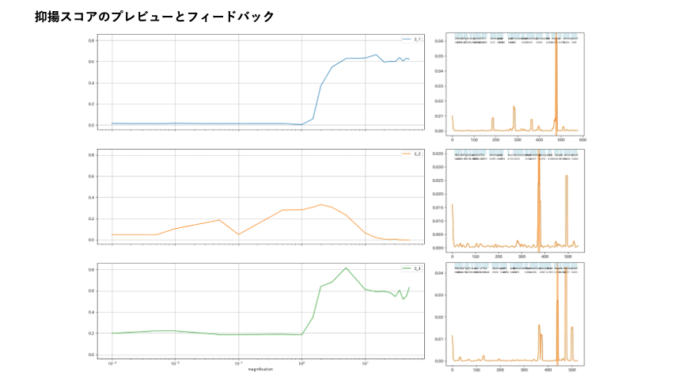
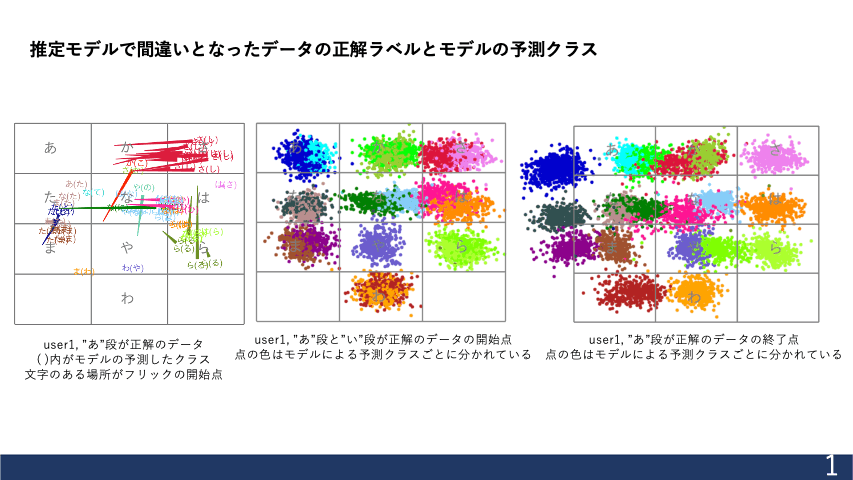

# TREEB23

> [!NOTE]
> このページでは全体で70MB程度のgifファイルを読み込みます。各コンテンツにgifファイルがリンクされていますがしばらく表示されないことがあります。

## <b> アーカイブ </b>

### <a href="https://github.com/treeb23/kineticwall2022">kineticwall2022</a> 
Touch Designerを用いてアニメーションをAPIにより取得した情報をもとに動的に制御。
大学最寄りの新宿駅の12路線を縦の列で表している。速度パターンや出現頻度は時間帯ごとに各路線の運行ダイヤから事前に計算しており、音楽や効果音、背景アニメーションの配色は時間帯・天気ごとに複数パターン用意した。駅に表示される発車標をモチーフにした路線遅延情報表示を行い、実用性も兼ねている。
チームリーダーとして応募し、メインプログラミング・初期デザイン案の提案を行った。壁フェス2022最終審査会にて2022年12月に発表。
 

### <a href="https://github.com/treeb23/simplewebapps/travelphotomap">写真で振り返る 思い出旅行マップ</a> 
旅行して写真を撮った思い出を地図に記録するアプリケーションを制作。ユーザーが撮影した写真のEXIF情報をもとに、地図上にその写真の記録を可視化する。写真間の座標差をもとにグループにまとめ、都市や地域ごとに写真を整理します。地図表示にはLeafletを使用し、Flexboxを用いたレイアウト設計により、シンプルで軽量なUIを実現している。グループをクリックすると、該当グループの平均座標に地図が移動し、グループに属する写真が表示され、写真の下部にはEXIF情報を表示している。写真をクリックすると、モーダルウィンドウが開き、拡大画像が表示される。ページをリロードしてもデータが保持されるほか、JSON形式およびCSV形式でデータの書き出し・読み込みを可能にしている。
 

### <a href="https://github.com/treeb23/simplewebapps/calendarapp">Simple Web Calendar</a> 
ブラウザ上で動作するシンプルなカレンダーアプリを作成。予定の追加・編集・削除、メモの管理、CSV形式での書き出しを行える。カレンダーの各日付セルをダブルクリックすることで予定を追加することができ、優先度順や日付順に並び替えるリスト表示や予定の編集、地図をクリックすることによる位置情報の追加、キーワード検索機能や他の予定とのリンク機能など、OS標準カレンダーの機能にはないあると便利な特徴を含んでいる。
 

### <a href="https://github.com/treeb23/repo24">高速キータイピングゲーム</a> 
2022年6月、マルチメディアに関する授業課題の一環で作成。AWS EC2インスタンスをUbuntuで起動し、サーバ側プログラムとクライアント側プログラムを組み合わせて動作する。HTML,CSS,Javascript,PHPを主に使用し、データベースを操作するプログラムによりランキング機能やスコア統計機能を用意した。
タイピングゲームでは難易度に応じて出題内容の文字の種類や長さが変化する。ランダムに問題が生成される。開始するとカーソルが入力欄に自動的にあい、タイマーを開始する。コピー&ペーストを禁止している。
 

### <a href="https://github.com/treeb23/repo24">discord appでローカルLLM</a> 
2025年1月、Deepseek-r1を4bit量子化した`melt-adzuki/DeepSeek-R1-Distill-Qwen-14B-Japanese-Q4-mlx`をローカル環境で実行できる環境を構築。discord appとして外出中でも常時ローカルLLMの使用が可能。
 

### <a href="https://github.com/treeb23/repo24">便利ツール</a> 
webUI構築にgradioを使用した便利ツールを作成。.movや.webmなどの動画ファイルをmp4(h264)に変換する機能、yt-dlpを使用した動画ダウンローダー、リアルタイム文字数カウンター、whisperを用いた文字起こし、バイトの給与計算を行うなど実生活でよく使うツールを作成した。クリップボードからのペースト機能やワンボタンで実行可能なインターフェース構築など実用ツールらしい使いやすさにこだわっている。
 

### <a href="https://github.com/treeb23/speechai">SpeechAI</a> 
英語プレゼンテーション評価システムの検討・評価を行う。
プレゼンテーション特有の発音(抑揚)に特化した発音評価、アドバイスの提供を行うことができる。
基本的にユーザが任意のプレゼンターを手本として学習することを可能としており、個別のニーズに対応することができるように設計。
Attention機構を用いた音声分類モデルを用いた抑揚アドバイスシステム、ASRモデルを用いた自動発音区間分割による単語毎の抑揚ベクトル比較システム、条件付き変分オートエンコーダを用いた発音フィードバックシステムを構築。

2024 IEEE Computer Society Signature Conference on Computers, Software and Applications (COMPSAC)、The 7th International Conference on AI in Information and Communication (ICAIIC 2025)にて発表
 

### <a href="https://github.com/treeb23/flickpy">Flickpy</a> 
AndroidスマートフォンでのGboardを用いたフリック入力において意図しない入力を修正するための機械学習モデルを構築。pythonライブラリとしてgithubからpipでインストール可能(*)。学習・テスト、ファインチューニング、データ拡張、可視化、データクレンジングを含めた前処理を一貫して行うことができる。特にフリック入力の個人特性の分析や、意図と異なる入力となったフリック傾向の可視化、学習時の特徴量選択やパラメータの設定を幅広く用意している。学習ログやテスト結果の集計、実験時のパラメータ詳細を一括でファイルに書き出すことで、実験の再現性を高めている。

*現在はprivateのためインストールにはPersonal access tokenを使用

 

<!--
参考: https://github.com/durgeshsamariya/awesome-github-profile-readme-templates/blob/master/templates/0xabdulkhalid.md
https://qiita.com/s-yoshiki/items/436bbe1f7160b610b05c
https://shields.io/badges/static-badge
-->

## <b> 言語と環境 </b>

- **使用言語**:

    
    
    
    
    
    
    

 

- **使用経験**:

    
    
    
    

 

- **使用ツール**:

    
    
    
    
    
    

 

- **OS**:

    
    
    
    

 

- **趣味**:

    
    
    

## <b> Github Stats </b>
 

